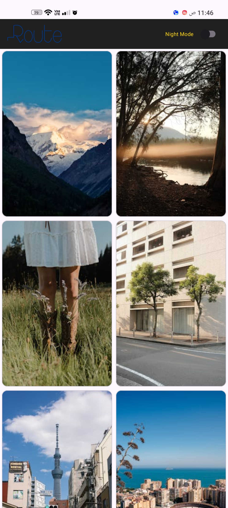
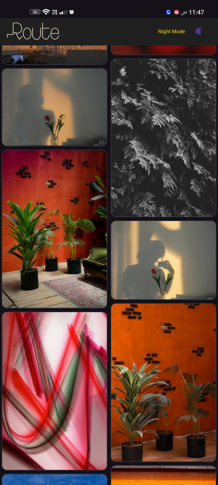
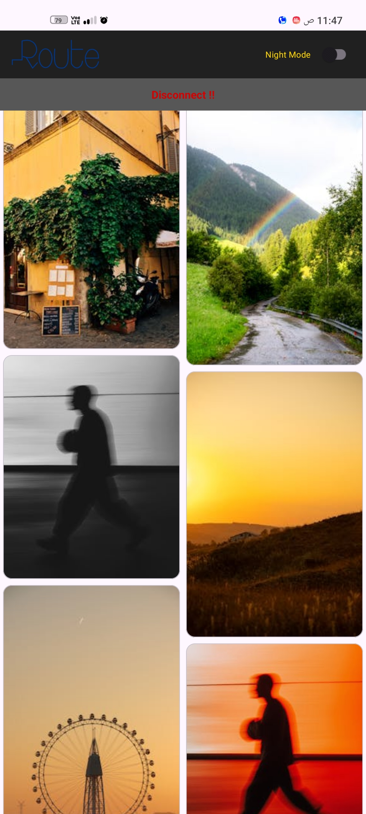
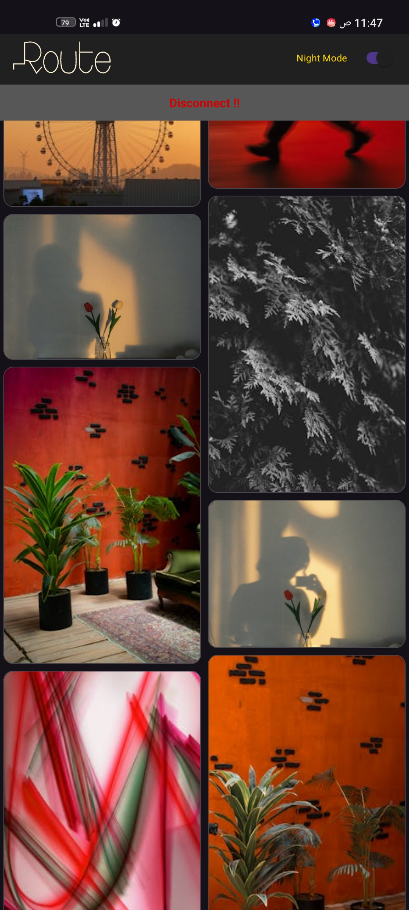
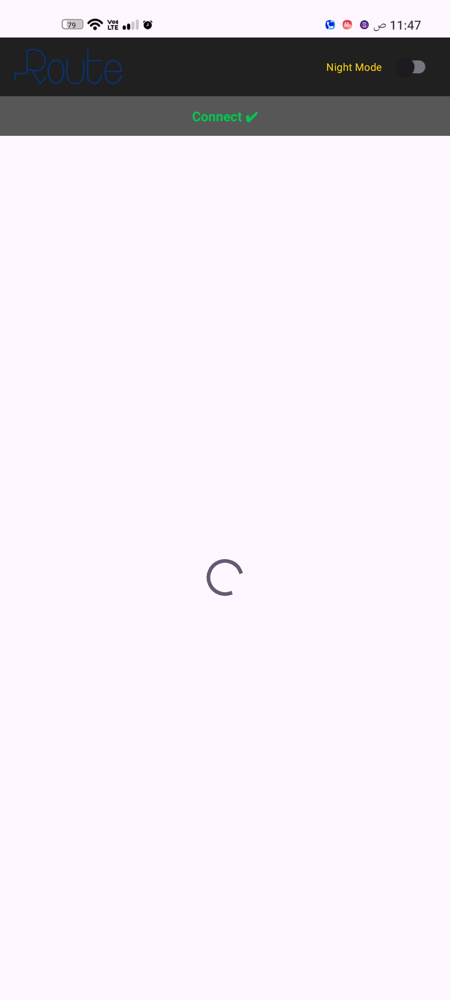
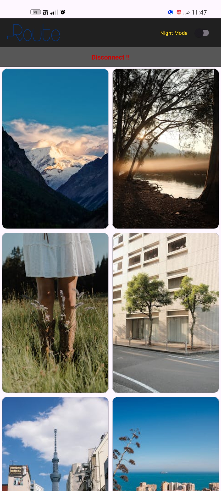

# 📸 Photo Gallery App

An Android application built with **Clean Architecture** and **MVVM**, that displays photos from the **Pexels API**.  
The app supports **offline caching** with Room Database, **Light/Dark theme switching**, and a **network status indicator**.

---

## **Features**
- **Photo fetching from Pexels API** (Online Mode).
- **Offline Mode:** Loads cached photos from Room Database when offline.
- **Light and Dark Themes:** Toggleable using a switch in the toolbar.
- **Network Status Indicator:** Displays whether the device is online or offline.
- **Pagination:** Loads photos in pages for smooth scrolling and better performance.
- **Loading & Error States:** Handles API loading and errors gracefully.
- **Clean Architecture:** Separated layers (data, domain, presentation) with a Repository Pattern and Use Cases.
- **Coroutines + Flow:** Asynchronous data handling and reactive UI updates.
- **Material Design 3 UI** with modern and responsive layouts.

---

## **Screenshots (Conceptual Descriptions)**

### **Photo List Screen**
<table>
  <tr>
    <td align="center">
      
      <br><b>Online - Light Mode</b>
    </td>
    <td align="center">
      
      <br><b>Online - Dark Mode</b>
    </td>
  </tr>
  <tr>
    <td align="center">
      
      <br><b>Offline - Light Mode</b>
    </td>
    <td align="center">
      
      <br><b>Offline - Dark Mode</b>
    </td>
  </tr>
</table>

---

### **States**
<table>
  <tr>
    <td align="center">
      
      <br><b>Loading State</b>
    </td>
    <td align="center">
      
      <br><b>Error State</b>
    </td>
    <td align="center">
      
      <br><b>Network Status</b>
    </td>
  </tr>
</table>

---

## **Video Demo**

[]([https://www.youtube.com/watch?v=YOUR_VIDEO_ID](https://drive.google.com/file/d/13uGey96eHFaB3vVkZrC5g3sMAXOZYfS7/view?usp=sharing))


---
## **App Architecture**

The project follows **Clean Architecture** with the following layers:

### **1. Data Layer**
- Contains Room Database (`DAO`, `Entities`) for local caching.
- Retrofit API service to fetch data from **Pexels API**.
- Repository implementation (`PhotoRepositoryImpl`) that decides whether to fetch data from **API** or **Room**.

### **2. Domain Layer**
- Contains **Models**, **Repository Interfaces**, and **Use Cases**.
- **Use Cases** (e.g., `GetPhotosUseCase`) handle the business logic and data flow between Repository and ViewModel.

### **3. Presentation Layer**
- Implements **MVVM pattern** using `ViewModel` + `LiveData/StateFlow`.
- Uses **Data Binding** for updating UI components.
- Contains UI elements (`Activities`, `Fragments`, `RecyclerView Adapters`).

### **Data Flow Diagram**
UI (Fragment/Activity)
↓
ViewModel
↓
Use Case
↓
Repository
↓ ↓
Room DB Retrofit (API)

---

## **Tech Stack**
- **Kotlin**
- **MVVM Architecture**
- **Clean Architecture + Use Cases**
- **Room Database**
- **Retrofit2 + OkHttp**
- **Hilt for Dependency Injection**
- **Coroutines + Flow**
- **Material Design 3**
- **Data Binding**

---

## **How to Run the Project**
1. **Clone the repository:**
    ```bash
    git clone https://github.com/Mohamed-El-Hofy/Photo_Gallery.git
    ```
2. **Add your Pexels API Key:**
   - Open `local.properties`.
   - Add:
     ```properties
     PEXELS_API_KEY=your_api_key
     ```
3. **Open the project** in **Android Studio (Arctic Fox or newer)**.
4. **Sync Gradle** and run the app on an emulator or a physical device.

---

## **Deliverables**
- Functional **Android project** implementing all the above requirements.
- **README.md** with:
  - Screenshots of all states (light/dark, online/offline).
  - Detailed explanation of the **app architecture**.
  - Setup and run instructions.

---


## **Developer**
- [Mohamed El-Hofy](https://github.com/Mohamed-El-Hofy)
